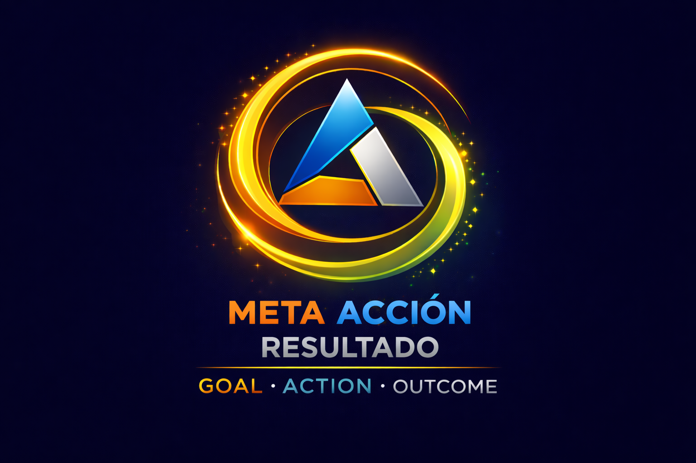

# Sistema de Timeboxing Bidimensional  

## Meta – Acción – Resultado (MAR) / Goal – Action – Outcome (GAO)  

Este documento define el sistema **Meta–Acción–Resultado (MAR)**  —*Goal–Action–Outcome (GAO)*— y su integración con un modelo de **timeboxing bidimensional (macro y micro)**, aplicado a los elementos de MAR: **eventos, hábitos, tareas y metas**.

Las **acciones** constituyen la **única unidad ejecutable** del sistema.

---

## 1. Marco conceptual del sistema MAR / GAO

| Español | Inglés | Función |
|--------|--------|---------|
| **Meta** | Goal | Dirección y propósito |
| **Acción** | Action | Ejecución concreta |
| **Resultado** | Outcome | Evidencia de avance |

> Nada se ejecuta sin convertirse en acción.  
> Nada se evalúa sin producir resultados.

En MAR:

- Las **metas** corresponden a **intenciones de plazo medio/largo** (con deadline).  
- Las **tareas** son trabajo flexible con fecha.  
- Las **acciones** son unidades atómicas que ocupan bloques de tiempo.  
- Los **resultados** se derivan de acciones ejecutadas de forma consistente.

---

## 2. Definición general del timeboxing

El sistema se estructura en dos niveles complementarios:

- **Macro-timeboxing**: gobierna metas, prioridades y revisiones.
- **Micro-timeboxing**: organiza la ejecución diaria en bloques indivisibles.

La ejecución **solo ocurre en el nivel micro** y **solo mediante acciones**.

### Objetivo del sistema MAR

Lo que se pretende con MAR es obtener una **ruta diaria** compuesta por **rutinas**. Cada rutina puede contemplarse desde dos perspectivas:

| Perspectiva | Vista |
|-------------|-------|
| **Micro-timeboxing** | Serie de pasos secuenciales para completar tareas |
| **Macro-timeboxing** | Progreso en proyectos y hábitos de vida |

La ruta diaria integra ambas vistas: en el nivel micro se ejecutan bloques; en el nivel macro se evalúa el avance hacia metas y la consolidación de hábitos.

---

## 2.1 Dimensiones temporales del sistema

Toda tarea, meta o resultado puede analizarse desde dos dimensiones temporales complementarias:

- **Diacrónica**, cuando se planifica en términos de duración y avance desde el presente.
- **Sincrónica**, cuando se vincula a un marco calendario con límites definidos.

> **El error habitual** en productividad es confundir ambas dimensiones, tratando procesos (diacrónicos) como si fueran eventos de calendario (sincrónicos), lo que genera fricción, ansiedad y sensación de fracaso.

### 2.1.1 Dimensión diacrónica (tiempo como duración)

**Definición operativa**

La **dimensión diacrónica** organiza el tiempo como **duración continua medida en número de días a partir del momento presente**.

- Se expresa como: `hoy + n días`
- No depende del calendario civil
- Ejemplos:
  - Próximos **7 días**
  - Próximos **14 días**
  - Próximos **30 días**
  - Horizonte de **90 días**

Aquí, *una semana* no es "esta semana", sino **un intervalo móvil de +7 días desde hoy**.

**Clave estructural**

👉 El tiempo se concibe como **flujo**, no como contenedor.

**Psicología del proceso**

La dimensión diacrónica activa principalmente:

- **Cognición prospectiva** (pensar hacia adelante desde el ahora)
- **Autorregulación continua**
- **Motivación orientada al progreso**
- **Percepción de control**

Psicológicamente:

- El sujeto se sitúa en el **centro del eje temporal**
- El tiempo es **personal**, flexible y ajustable
- Reduce la ansiedad asociada a fechas "externas"
- Favorece el *"¿qué puedo avanzar en los próximos X días?"*

👉 Ideal para:

- Desarrollo de proyectos
- Sprints
- Hábitos
- Investigación
- Procesos complejos y acumulativos

### 2.1.2 Dimensión sincrónica (tiempo como marco calendario)

**Definición operativa**

La **dimensión sincrónica** organiza el tiempo en **ventanas fijas definidas por el calendario**, con límites socialmente establecidos.

- Se expresa como: `intervalos cerrados`
- Depende del calendario
- Ejemplos:
  - **Esta semana** (hasta domingo)
  - **Este mes** (hasta último día del mes)
  - **Este año** (hasta 31 de diciembre)

Aquí el foco no es la duración, sino **la pertenencia a un marco temporal compartido**.

**Clave estructural**

👉 El tiempo se concibe como **estructura**, no como flujo.

**Psicología del compromiso y la norma**

La dimensión sincrónica activa principalmente:

- **Conciencia normativa**
- **Evaluación social y externa**
- **Cierre cognitivo**
- **Percepción de urgencia simbólica**

Psicológicamente:

- El sujeto se adapta a **marcos compartidos**
- El tiempo impone **límites externos**
- Aumenta la presión por cerrar tareas
- Favorece el *"tiene que estar listo antes de…"*

👉 Ideal para:

- Entregas
- Docencia
- Evaluaciones
- Informes
- Obligaciones institucionales

### 2.1.3 Comparación sintética

| Aspecto             | Diacrónica               | Sincrónica                         |
| ------------------- | ------------------------ | ---------------------------------- |
| Tipo de tiempo      | Duración                 | Marco                              |
| Referencia          | Hoy                      | Calendario                         |
| Límites             | Móviles                  | Fijos                              |
| Control percibido   | Alto                     | Medio–bajo                         |
| Estrés asociado     | Bajo–moderado            | Moderado–alto                      |
| Función psicológica | Proceso                  | Cierre                             |
| Pregunta clave      | "¿Qué avanzo en X días?" | "¿Qué debe estar hecho antes de…?" |

### 2.1.4 Encaje con el sistema Meta–Acción–Resultado

- **Metas** → preferentemente **diacrónicas**
- **Acciones** → mixtas
- **Resultados** → preferentemente **sincrónicos** (verificables, cerrables)

Esto refuerza la coherencia psicológica del modelo y justifica por qué **no todo debe tener fecha de calendario**.

---

## 3. Macro-timeboxing (nivel estructural)

El macro-timeboxing define **cuándo se planifica, revisa y gobierna** cada elemento, sin asignación horaria concreta.

### 3.1 Escalas temporales

| Escala | Función |
|--------|--------|
| Diaria | Ejecución |
| Semanal | Priorización |
| Mensual | Consolidación |
| Anual | Dirección estratégica |

### 3.2 Clasificación por tipo de elemento

| Tipo (MAR) | Escala macro dominante |
|---------------|------------------------|
| Eventos | Diaria / Semanal |
| Hábitos | Diaria / Semanal / Anual |
| Tareas | Diaria / Semanal |
| Metas | Mensual / Anual |

El macro-timeboxing **clasifica**, no fragmenta.

---

## 4. Micro-timeboxing (nivel operativo)

La jornada se divide en **bloques indivisibles de 30 minutos**, que constituyen la unidad mínima de compromiso.

### 4.1 Qué se asigna a un bloque

Un bloque **no equivale necesariamente a una acción completa**: las acciones pueden durar más o menos de 30 minutos. Lo que se asigna a cada bloque es:

- **Una parte de una acción** (si dura más de 30 min): se toma un subobjetivo o un pequeño progreso concreto para realizar en esos 30 minutos.
- **Un conjunto de acciones** (si son de corta duración): varias acciones que en total no superen los 30 minutos. Lo ideal es que sean **similares** en objetivos, contexto o recursos necesarios, para minimizar el coste de cambio.

> En MAR, los **eventos** ocupan bloques directamente;  
> las **metas y tareas** generan acciones que ocupan bloques.

### 4.2 Regla de foco durante el bloque

Durante cada bloque de 30 minutos **solo se ejecuta lo planificado**. Si surge cualquier demanda externa o interna que llame la atención:

1. **Se anota** para tenerla en cuenta.
2. **Se espera** a que termine el bloque.
3. **Transcurridos los 30 minutos**, se decide: ¿se realiza en el siguiente bloque o se planifica para otro momento?

Esta regla protege la concentración y evita que las interrupciones fragmenten el tiempo comprometido.

### 4.3 Bloques flexibles respecto al horario

Los 30 minutos **no tienen por qué regirse por el horario natural del día**. Pueden establecerse desde cualquier momento de inicio.

**Ejemplo:** Si se comienza a las 12:10, el primer bloque va de 12:10 a 12:40, el siguiente de 12:40 a 13:10, y así sucesivamente.

Esto puede generar **solapamientos con eventos fijados**. Para resolverlos, se usan **minibloques**.

### 4.4 Minibloques ante huecos y eventos

Cuando un bloque flexible deja un **hueco** antes de un evento con hora fija, ese hueco se trata como un **minibloque separado**, con entidad propia.

**Ejemplo:** Cita online a las 13:30. El bloque anterior termina a las 13:20. El intervalo 13:20–13:30 (10 minutos) es un minibloque independiente: se planifica una tarea que **solo ocupe ese tiempo**.

### 4.5 Propósito y consecuencia entre bloques

En conjunto, los bloques y minibloques deben tener un **propósito general** y una **consecuencia** que sostenga la motivación. Si un bloque implica una tarea poco agradable o exigente, el siguiente debe compensar con algo más relajado o interesante.

**Ejemplo:** Si dedico 30 minutos a responder correos (algo que no me gusta), el siguiente bloque haré algo más relajado o motivante: ordenar mi mesa, buscar el billete para el viaje al congreso del próximo mes, etc.

Esta alternancia reduce el desgaste y mantiene el compromiso a lo largo del día.

### 4.6 Hábito y rutinas por bloques: Est–Rs–Er+

Un hábito se define por la **discriminación de una situación** (no por la mera repetición). Esto aplica no solo a los Hábitos como tipo MAR (sección 6.2), sino también al **hábito de realizar una acción o serie de acciones en un bloque de 30 minutos**.

Al parcelar el día en bloques, se pueden dedicar a distintas **rutinas diarias**. Cada rutina puede repetirse o no en otros días; lo relevante es que, en sí misma, cada rutina es un «hábito» en el sentido de tener **consolidada una secuencia Est–Rs–Er+**. Así, todo bloque (o secuencia de bloques) puede seguir esta estructura:

| Componente | Nombre | Función | Ejemplo |
|------------|--------|---------|---------|
| **Est** | Estímulo | Regla de implementación: cuándo y dónde | *Si son las 12:10 y estoy en mi despacho, me dedicaré 30 minutos a…* |
| **Rs** | Respuesta | La acción o conjunto de acciones | *…responder correos atrasados* |
| **Er+** | Reforzador | Consecuencia o premio en el siguiente bloque | *…tras lo cual me dedicaré a buscar el billete de avión para mi viaje del mes que viene al congreso de…* |

**Regla:** El estímulo define el *gatillo* (contexto + hora); la respuesta es *lo que hago ahora*; el reforzador es *lo que haré después* como recompensa. Así se encadenan bloques con propósito y consecuencia explícitos.

### 4.7 Resumen de bloques

- Un bloque estándar = 30 minutos.  
- Un bloque se asigna a **una parte de acción**, **un subobjetivo**, o **un conjunto de acciones** que no superen 30 min.  
- Los bloques se encadenan con **propósito y consecuencia** (alternar exigente ↔ relajado/interesante).  
- Se usa la estructura **Est–Rs–Er+** para definir hábitos y rutinas por bloques (consolidar secuencia situación → respuesta → reforzador).  
- Todo bloque debe cerrarse con un **estado explícito**.

---

## 5. Acciones (Actions)

### 5.1 Definición

Una **acción (action)** es una unidad **ejecutable, estimable, trazable, verificable y medible** que puede realizarse en uno o más bloques de 30 minutos.

> Solo las acciones pueden ocupar bloques.

### 5.2 Verificabilidad y medibilidad

Toda acción debe ser **verificable** (se puede comprobar si se completó) y **medible** (tiene criterios claros de alcance). Evitar formulaciones vagas como «responder correos»; preferir criterios explícitos.

**Ejemplo:**

| ❌ Vago | ✅ Verificable y medible |
|---------|---------------------------|
| Responder correos | Responder al menos todos los correos de hoy y ayer, y revisar correos previos por si debería responder alguno |

### 5.3 Origen de las acciones

Las acciones proceden de:

- **Metas** (vía descomposición)  
- **Tareas** (vía atomicidad)

En Todoist, esto se implementa como **tareas atómicas** (sin subtareas internas de alto nivel conceptual).

---

## 6. Tipos de elementos y reglas

### 6.1 Eventos (Events)

**Características**

- Fecha y hora obligatorias.  
- Duración conocida.

**Reglas**

- Los eventos **reservan bloques automáticamente** en el calendario mental del día.  
- No generan acciones adicionales.  
- No compiten por priorización con acciones: son compromisos rígidos.

Ejemplo:  
Evento 10:00–11:30 → 3 bloques bloqueados.

---

### 6.2 Hábitos (Habits)

**Definición conceptual (compartida con rutinas por bloques)**

Un hábito **no procede de la repetición de una acción**, sino de la **discriminación de una situación** ante la cual se actúa de un mismo modo y se obtienen unas recompensas. Se reconoce el contexto (estímulo), se responde de forma consistente (respuesta) y se recibe el reforzador. La estructura Est–Rs–Er+ modela precisamente este patrón.

Esta misma definición aplica a las **rutinas por bloques** (sección 4.6): al parcelar el día en bloques de 30 minutos, cada rutina asignada a un bloque —ya repita o no en otros días— es un «hábito» en tanto tenga consolidada la secuencia Est–Rs–Er+. Los Hábitos (tipo MAR) son un caso particular: rutinas recurrentes en el sistema.

**Características en MAR**

- Fecha de repetición.  
- Sin hora fija.

**Reglas**

- Cada hábito ocupa **1 bloque por ocurrencia**.  
- No se consideran acciones (son rutina, no proyecto).  
- Se asignan **antes que las acciones** derivadas de metas/tareas.

---

### 6.3 Metas (Goals)

**Características**

- Fecha de inicio (opcional).  
- Fecha límite obligatoria (deadline).

**Regla fundamental**

> Las metas **no se ejecutan directamente**.

Proceso:

1. La meta se descompone en **acciones**.  
2. Las acciones se estiman en bloques.  
3. Los bloques se ejecutan en el día.

Las metas gobiernan la dirección;  
las acciones materializan el avance.

---

### 6.4 Tareas (Tasks)

**Características**

- Fecha de inicio.  
- Alcance limitado.

**Reglas**

- Toda tarea debe convertirse en **una o varias acciones**.  
- Cada acción se estima en **n bloques**.  
- No se recomiendan más de **3 bloques consecutivos** por acción.

---

## 7. Algoritmo diario de planificación

La asignación de bloques sigue un **orden estricto**:

1. **Eventos** (bloques reservados).  
2. **Hábitos**.  
3. **Acciones derivadas de metas activas**.  
4. **Acciones derivadas de tareas**.

Si no quedan bloques libres, **no se planifica nada más**.

Este algoritmo convive con los **horizontes temporales** de MAR:

- Los horizontes (+->Hoy, -+>1 Día, etc.) dicen **cuándo vive** cada compromiso.  
- El timeboxing MAR/GAO dice **en qué bloques concretos** se ejecuta.

---

## 8. Estados de cierre de bloque

Todo bloque asociado a una acción debe cerrarse en uno de estos estados:

- ✅ Completado (*Completed*).  
- 🔁 Migrado (*Migrated*, con justificación).  
- ❌ Cancelado (*Cancelled*, con causa).

Estos estados son la base para derivar métricas y resultados.

---

## 9. Resultados (Outcomes)

Un **resultado (outcome)** es la **agregación evaluable** de acciones ejecutadas.

> Resultado ≠ acción completada.  
> Resultado = **conjunto coherente de acciones ejecutadas con eficacia**.

Ejemplos:

- “Preparar informe trimestral enviado” puede requerir 6–8 bloques ejecutados en acciones distintas.  
- “Dominar un tema” se evidencia por bloques recurrentes de estudio + producción.

---

## 10. Métricas derivables

Al combinar MAR + MAR/GAO se pueden obtener métricas como:

- Acciones planificadas vs ejecutadas.  
- Bloques por acción.  
- % de bloques completados.  
- Tasa de migración.  
- Distribución de acciones por meta / tarea / horizonte.  
- Carga de trabajo por día / semana / mes.

---

## 11. Principios del sistema MAR / GAO

- Las **metas dirigen**, las **acciones ejecutan**, los **resultados evidencian**.  
- El tiempo se compromete en **bloques**, no en intenciones vagas.  
- La sobreplanificación está prohibida: no se asignan más bloques de los disponibles.  
- Toda acción debe ser **verificable y medible** (criterios claros de completitud).
- Todo avance debe ser **medible y revisable**.  
- Los horizontes temporales de MAR y el timeboxing MAR/GAO se usan juntos, nunca en conflicto.
- Los bloques se encadenan con **propósito y consecuencia** (Est–Rs–Er+): alternar exigente ↔ reforzador para sostener la motivación.

---

## 12. Notas de implementación

El sistema MAR/GAO es agnóstico de herramienta y puede implementarse sobre:

- **Obsidian** (Markdown + propiedades).  
- **Notion** (bases relacionales).  
- **Todoist** (acciones como tareas atómicas dentro del marco MAR).

En el contexto de MAR:

- Los **tipos temporales** (Evento, Hábito, Meta, Tarea, Idea) definen **qué es** cada elemento.  
- Los **horizontes y bandejas** definen **cuándo vive**.  
- MAR/GAO y el **timeboxing bidimensional** definen **cómo se ejecuta y cómo se mide**.

El sistema **Meta–Acción–Resultado / Goal–Action–Outcome** se convierte así en el **marco único de ejecución y evaluación** sobre la ontología temporal de MAR.

