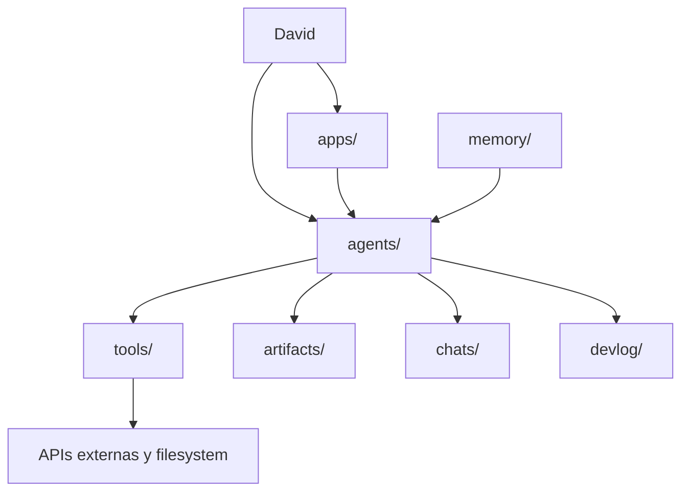

# Arquitectura Operativa

## Division Canonica

| Codigo | Sistema | Rol | Entry Point |
| --- | --- | --- | --- |
| `MAR` | Todoist | Ejecuta tareas, eventos, habitos, metas e ideas | `agents/todoist_agent.py` |
| `PTN` | Notion | Dirige proyectos, tareas y notas formales | `agents/notion_agent.py` |
| `KIT` | Notion | Cataloga conocimiento, informacion y herramientas | `agents/kit_agent.py` |
| `GIT` | GitHub -> Notion | Cataloga repositorios | `agents/github_agent.py` |
| `BIB` | Paperpile -> Notion | Cataloga bibliografia | `agents/bib_agent.py` |
| `ABGD` | Obsidian | Almacena notas y jerarquia documental | `agents/obsidian_agent.py` |
| `INX` | Cross-system | Enlaza entidades entre sistemas | `agents/orchestrator_agent.py` |

## Carpetas Top-Level

| Carpeta | Responsabilidad | Ejemplos |
| --- | --- | --- |
| `agents/` | CLIs por dominio | `todoist_agent.py`, `kit_agent.py` |
| `tools/` | Wrappers, syncs, validadores y utilidades | `sync_inx_links.py`, `memory_check.py` |
| `apps/` | GUIs, dashboards y lanzadores Windows | `dashboard.py`, `project_hub_gui.py` |
| `docs/` | Guias funcionales para humanos | `pipeline-atlas.md`, `casos-de-uso/` |
| `bookdown/` | Manual navegable y validable | `_bookdown.yml`, `_book/index.html` |
| `memory/` | Memoria curada del proyecto | `INDEX.md`, `PURPOSE.md`, `STRUCTURE.md` |
| `chats/` | Hilo diario append-only | `chat_YYYY-MM-DD.md` |
| `devlog/` | Hitos feature-level append-only | `DEVLOG.md` |
| `artifacts/` | Salidas regenerables | `multiagent/`, `daily/`, `inx/` |
| `playbooks/` | Metodologias reutilizables | `bookdown-exhaustive-project-playbook.md` |
| `Sistemas/` | Referencias y repos externos no ejecutables | `ABC/`, `systec-main/` |

## Flujo De Responsabilidades

## Reglas De Crecimiento

| Cambio | Donde Debe Reflejarse |
| --- | --- |
| Nuevo agente de dominio | `agents/`, `tools/`, `docs/`, `memory/`, bookdown |
| Nueva utilidad transversal | `tools/`, catalogo de scripts, tests si aplica |
| Nueva GUI | `apps/`, docs de uso, catalogo de apps |
| Nueva carpeta top-level | `memory/INDEX.md`, `memory/STRUCTURE.md`, bookdown |
| Nuevo artefacto derivado | `artifacts/<nombre>/`, script regenerador, docs |
| Nuevo playbook | `playbooks/`, indice local, memoria si inaugura familia |

## Estado Real

Coworkia es local-first. No es SaaS ni sistema multiusuario. La mayoria de capacidades dependen de credenciales y bases externas accesibles por API.
