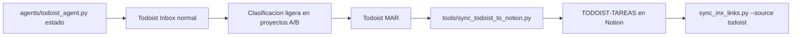
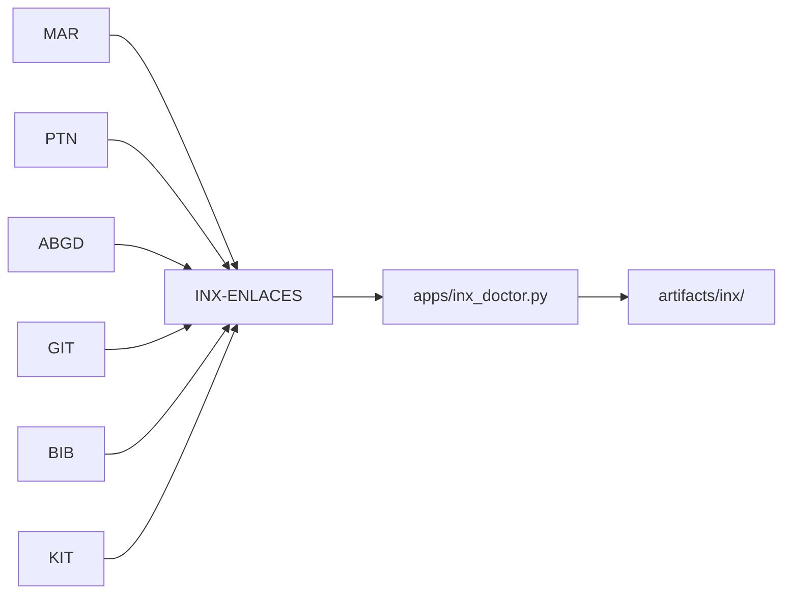

# Pipelines Principales

## MAR Diario

| Paso | Comando | Salida |
| --- | --- | --- |
| Ver estado | `python agents/todoist_agent.py estado` | Resumen del sistema |
| Revisar inbox real | `python -c "from tools.todoist_tools import get_tasks; tasks=get_tasks(project_id='6Crfvj4MWg6GfVq6'); print(len(tasks))"` | Cola `Inbox` normal |
| Ver detalle | `python agents/todoist_agent.py ver <TASK_ID>` | Tipo MAR, descripcion, fechas |
| Mover a bloque | `python agents/todoist_agent.py mover <TASK_ID> <PROJECT_ID>` | Entrada fuera de Inbox |
| Sincronizar a Notion | `python tools/sync_todoist_to_notion.py --limit 200` | Filas en `TODOIST-TAREAS` |
| Propagar a INX | `python tools/sync_inx_links.py --source todoist --limit 200` | Filas `todoist:<id>` en `INX-ENLACES` |

`Inbox` significa el proyecto normal de Todoist (`project_id=6Crfvj4MWg6GfVq6`).
Los proyectos `Z-*` son backs/staging y no se consultan en el arranque diario
salvo peticion explicita.

## PTN Proyectos

| Paso | Comando | Salida |
| --- | --- | --- |
| Estado | `python agents/notion_agent.py estado` | Diagnostico PTN |
| Proyectos | `python agents/notion_agent.py proyectos` | Lista de proyectos |
| Tareas | `python agents/notion_agent.py tareas` | Lista de tareas |
| Notas | `python agents/notion_agent.py notas` | Lista de notas |

## KIT, GIT Y BIB

| Sistema | Comando Principal | Validacion Relacionada |
| --- | --- | --- |
| KIT | `python agents/kit_agent.py estado` | `python tools/validate_case_08.py --scope c` |
| GIT | `python agents/github_agent.py estado` | `python tools/validate_case_05.py --scope c` |
| BIB | `python agents/bib_agent.py estado` | `python tools/validate_case_06.py --scope c` |

## ABGD Obsidian

| Paso | Comando | Salida |
| --- | --- | --- |
| Mapa | `python agents/obsidian_agent.py mapa` | Jerarquia del vault |
| Ultimas notas | `python agents/obsidian_agent.py ultimas --n 15` | Notas recientes |
| Buscar | `python agents/obsidian_agent.py buscar "termino"` | Coincidencias |
| Nueva nota | `python agents/obsidian_agent.py nueva-nota A1-INV B12-LAB C125-DAT "Titulo"` | Nota en vault |

## INX Trazabilidad

| Paso | Comando | Salida |
| --- | --- | --- |
| Sync completo | `python agents/orchestrator_agent.py inx-sync --limit 200` | Upserts INX |
| Doctor | `python apps/inx_doctor.py` | Diagnostico de enlaces |
| Report diario | `python apps/inx_daily.py --limit 200` | Markdown en `artifacts/inx/` |

## Criterio De Realidad

| Estado | Significado En Coworkia |
| --- | --- |
| Local | Funciona en la maquina con `.env` valido |
| API externa | Requiere proveedor y permisos |
| Regenerable | Puede reconstruirse desde fuentes canonicas |
| Manual | Requiere accion de David en UI externa |
| Pendiente | Existe diseño o doc, pero no ejecucion validada |
