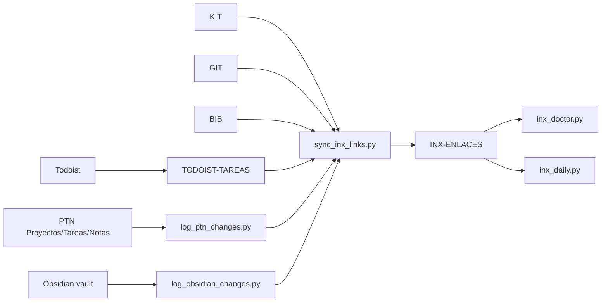

# INX Arquitectura De Trazabilidad

## Para Que Sirve

`INX` es la capa puente de Coworkia. Su objetivo no es almacenar el contenido de los sistemas, sino permitir que una entidad de Todoist, Notion, GitHub, Paperpile, KIT u Obsidian pueda encontrarse, auditarse y relacionarse con las demas.

`INX-ENLACES` vive en Notion y se sincroniza principalmente con `tools/sync_inx_links.py`.

## Principio De Autoridad

| Sistema | Autoridad | INX Guarda |
| --- | --- | --- |
| MAR | Todoist | `todoist:<id>`, URL, relaciones PTN/ABC si existen |
| PTN | Notion Proyectos/Tareas/Notas | `ptn:<page_id>` desde log PTN |
| KIT | Notion KIT | `kit:<page_id>`, Fuente=KIT, URL/metadata |
| GIT | GitHub + Notion GIT | `github:<nombre_repo>` |
| BIB | Paperpile + Notion BIB | `paperpile:<citekey>` |
| ABGD | Vault Obsidian + OBSIDIAN_DB | `obsidian:<ruta>` |

INX no reemplaza la fuente. Si una fila INX discrepa con la fuente, se corrige la fuente o el sync, no se convierte INX en verdad primaria.

## Flujo General



## Fuentes De Sync

| Source | Comando | Fuente Leida | Clave Creada |
| --- | --- | --- | --- |
| `todoist` | `python tools/sync_inx_links.py --source todoist --limit 200` | `TODOIST-TAREAS` | `todoist:<id>` |
| `notion` | `python tools/sync_inx_links.py --source notion --limit 200` | `NOTION_DB` log PTN | `ptn:<id>` |
| `obsidian` | `python tools/sync_inx_links.py --source obsidian --limit 200` | `OBSIDIAN_DB` | `obsidian:<ruta>` |
| `github` | `python tools/sync_inx_links.py --source github --limit 200` | `NOTION_DB_GIT` | `github:<nombre>` |
| `paperpile` | `python tools/sync_inx_links.py --source paperpile --limit 200` | `NOTION_DB_BIB` | `paperpile:<citekey>` |
| `kit` | `python tools/sync_inx_links.py --source kit --limit 200` | `NOTION_DB_KIT` | `kit:<page_id>` |
| `all` | `python tools/sync_inx_links.py --source all` | Todas las anteriores | Todas |

## Convenciones De Clave

| Prefijo | Ejemplo | Razon |
| --- | --- | --- |
| `todoist:` | `todoist:123456789` | ID estable de tarea Todoist |
| `ptn:` | `ptn:340622cf315b...` | Page ID Notion normalizado |
| `obsidian:` | `obsidian:A1-INV/B13-PUB/N...md` | Ruta relativa como identificador documental |
| `github:` | `github:coworkia` | Nombre de repo como fuente GitHub |
| `paperpile:` | `paperpile:Autor2024x` | Citekey canonica |
| `kit:` | `kit:340622cf315b...` | Page ID KIT |

## Relaciones Curadas

Algunas relaciones no se derivan automaticamente de la fuente, sino que se establecen mediante helpers o acciones especificas.

| Relacion | Helper/Comando | Nota |
| --- | --- | --- |
| Repo GIT -> proyecto PTN | `link_repo_to_ptn(repo_nombre, proyecto_ref)` | Escribe relation en fila `github:*` |
| Paper BIB -> proyecto PTN | `link_paper_to_ptn(citekey, proyecto_ref)` | Escribe relation en fila `paperpile:*` |
| Articulo Inoreader/KIT -> proyecto PTN | `link_article_to_ptn(inoreader_id, proyecto_ref)` | Usa fila `kit:*`, no crea `inoreader:*` |
| Obsidian -> PTN | `promote_obsidian_to_ptn.py --sync` | Crea PTN nota y cruces derivados |
| BIB -> Obsidian | `promote_bib_to_obsidian.py --sync` | Crea ficha y cruza `obsidian:*` + `paperpile:*` |

Regla importante: los syncs de GIT, BIB y KIT preservan `Estado=Verificado` y relaciones curadas porque no sobrescriben esas propiedades en cada upsert.

## Doctor Y Reportes

| Herramienta | Uso | Salida |
| --- | --- | --- |
| `apps/inx_doctor.py` | Diagnostico de coherencia INX | Consola |
| `apps/inx_daily.py --limit 200` | Sync + doctor + reporte diario | `artifacts/inx/inx-daily-*.md` |
| `tools/validate_case_05.py --scope c` | Auditoria GIT en INX | Exit code |
| `tools/validate_case_06.py --scope c` | Auditoria BIB en INX | Exit code |
| `tools/validate_case_08.py --scope c` | Auditoria KIT y backrefs | Exit code |
| `tools/validate_case_12.py` | Cobertura vault -> OBSIDIAN_DB -> INX | Exit code |
| `tools/obsidian_wikilinks.py audit` | Resolver wikilinks cross-system contra INX | Consola |

## Pipeline Diario Recomendado

```bash
python agents/orchestrator_agent.py inx-sync --limit 200
python apps/inx_doctor.py
python apps/inx_daily.py --limit 200
```

En Windows:

```bat
apps\inx_daily.bat 200
```

## Errores Frecuentes

| Sintoma | Interpretacion | Accion |
| --- | --- | --- |
| `kit=0` tras sync | `NOTION_DB_KIT` vacio o inaccesible | Revisar `.env` y permisos Notion |
| Wikilink roto aunque existe la entidad | INX no esta sincronizado | Ejecutar `orchestrator inx-sync` |
| Fila duplicada por `Clave` | Bug de upsert o limpieza pendiente | Parar syncs y correr dedupe controlado |
| Timeout Notion | Latencia API | Reintentar y validar con caso especifico |
| Falta relation PTN en fila GIT/BIB/KIT | No se uso helper de link | Ejecutar helper o comando de enlace |

## Stop Conditions

| Situacion | Parar |
| --- | --- |
| Duplicados masivos en `INX-ENLACES` | Si, antes de cualquier nuevo sync |
| `NOTION_DB_INX` vacio inesperadamente | Si, verificar ID y permisos |
| Sync degrada campos curados | Si, revisar payload de `_sync_*` |
| Reset real sin dry-run | Si, ejecutar `validate_case_14.py` antes |

## Que Debe Recordar Un Usuario

- INX es resolver y auditor, no fuente primaria.
- La propiedad `Clave` es el contrato principal.
- `--scope c` en validadores detecta problemas que un conteo basico no ve.
- Los reportes en `artifacts/inx/` son evidencias regenerables, no memoria curada.
