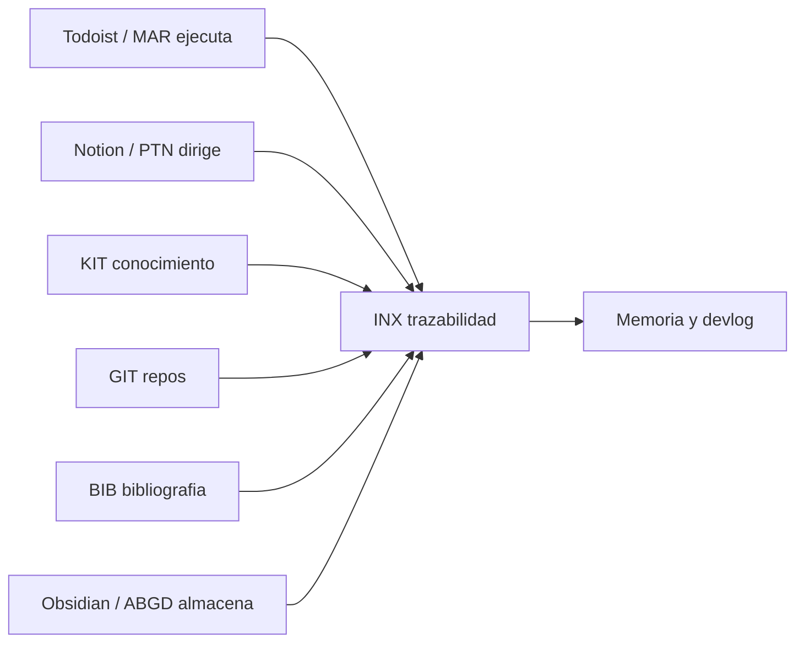

# Coworkia

## Para Que Sirve Este Manual

Este manual es la capa navegable de Coworkia. Reune en un recorrido unico lo que hoy esta repartido entre `README.md`, `memory/`, `docs/`, `agents/`, `tools/`, `apps/`, `chats/`, `devlog/` y `playbooks/`.

Coworkia es un sistema multiagente local para gestion personal y de conocimiento. Integra Todoist, Notion, GitHub, Paperpile y Obsidian bajo una taxonomia comun `ABC` y una capa de trazabilidad `INX`.

## Ruta De Lectura

| Perfil | Empieza Por | Objetivo |
| --- | --- | --- |
| Usuario nuevo | Instalacion y arranque | Poner el sistema en marcha sin leer codigo |
| Operador diario | Pipelines principales | Ejecutar MAR, PTN, KIT, GIT, BIB, ABGD e INX |
| Desarrollador | Arquitectura operativa | Entender carpetas, entrypoints y contratos |
| Revisor | Catalogos maestros | Auditar scripts, docs y validaciones |
| Agente IA | Operacion y mantenimiento | Respetar memoria, chat, devlog y protocolo |

## Mapa Mental

## Fuentes Canonicas

| Fuente | Rol |
| --- | --- |
| `memory/INDEX.md` | Mapa de recursos para agentes |
| `memory/PURPOSE.md` | Vision, sistemas y principios |
| `memory/STRUCTURE.md` | Estructura del repo y arbol actual |
| `README.md` | Guia publica y comandos principales |
| `docs/` | Documentacion funcional por sistema |
| `chats/chat_YYYY-MM-DD.md` | Conversacion viva multiagente |
| `devlog/DEVLOG.md` | Hitos feature-level append-only |

## Que Debe Recordar Un Usuario

- Todoist ejecuta, Notion dirige y Obsidian almacena.
- `INX` enlaza entidades entre sistemas; no sustituye a los sistemas fuente.
- La memoria versionada del repo manda sobre recuerdos locales de agentes.
- El manual debe describir capacidades reales y marcar lo pendiente.
