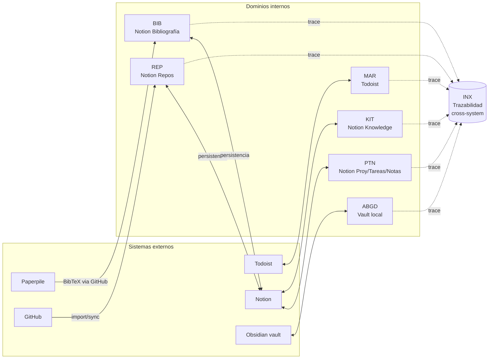
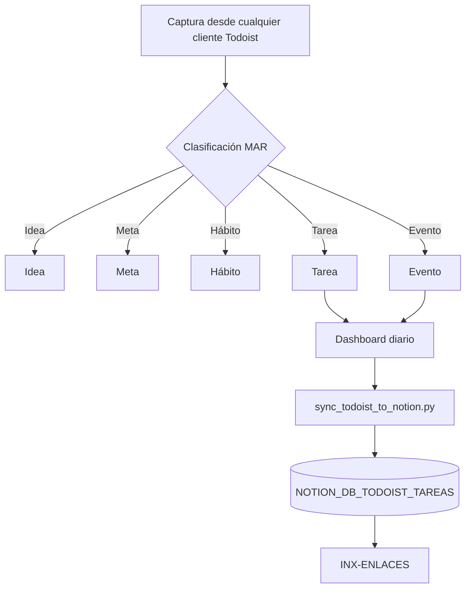
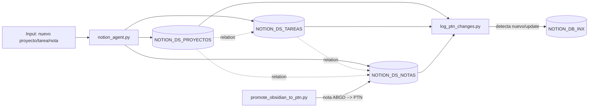
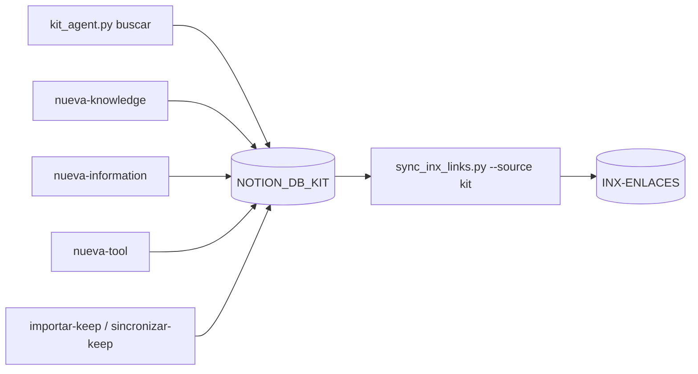
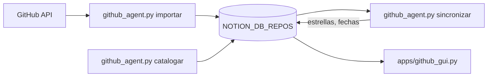
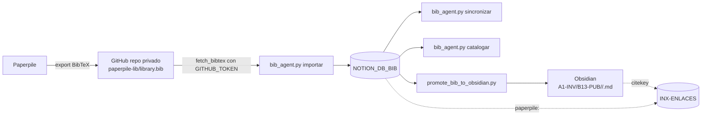
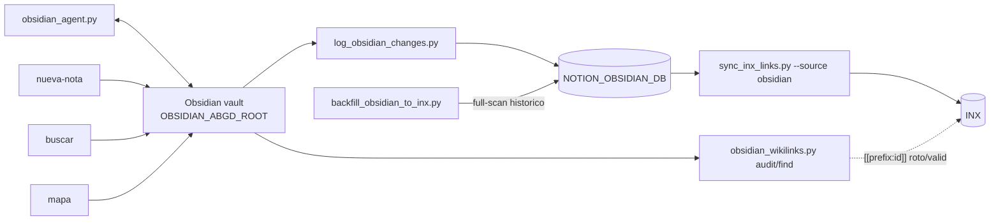
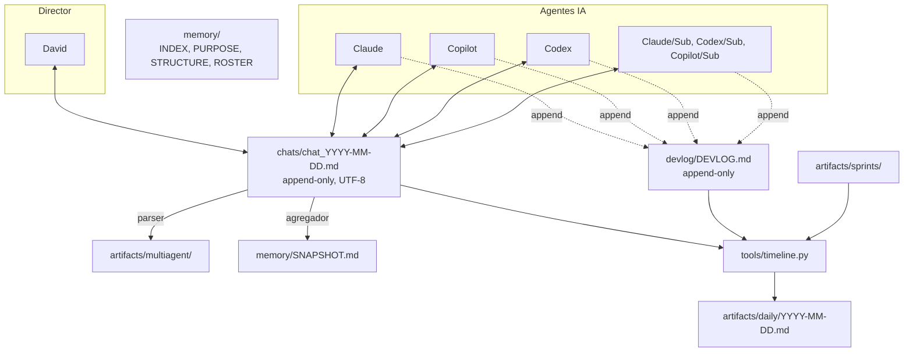
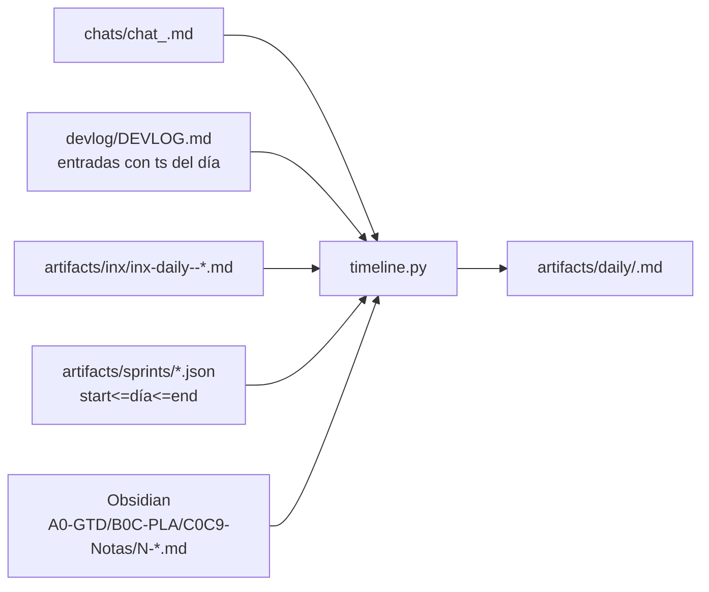
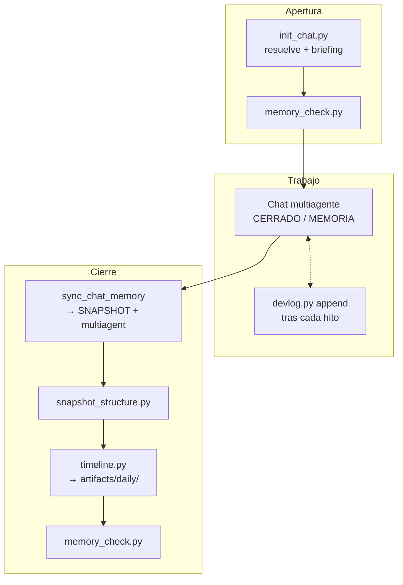

# Pipeline Atlas — Coworkia

> Mapa completo del proyecto en una sola doc. Dos capas separadas para que cada diagrama siga siendo legible:
>
> 1. **Capa de datos** — 6 dominios (MAR, PTN, KIT, REP, BIB, ABGD) + INX como glue de trazabilidad.
> 2. **Capa de coordinación** — chat multiagente + devlog + memoria curada + timeline + sprints + subagentes.
>
> Los diagramas están en Mermaid (renderiza GitHub y Obsidian). Para verlos interactivos abre [apps/pipeline_gui.py](../apps/pipeline_gui.py).

## Índice

- [Capa de datos](#capa-de-datos)
  - [MAR — Todoist](#mar--todoist)
  - [PTN — Notion proyectos/tareas/notas](#ptn--notion-proyectostareasnotas)
  - [KIT — Notion knowledge/information/tools](#kit--notion-knowledgeinformationtools)
  - [REP — GitHub → Notion](#rep--github--notion)
  - [BIB — Paperpile → GitHub → Notion → Obsidian](#bib--paperpile--github--notion--obsidian)
  - [ABGD — Obsidian vault](#abgd--obsidian-vault)
  - [INX — Trazabilidad cross-system](#inx--trazabilidad-cross-system)
- [Capa de coordinación](#capa-de-coordinación)
  - [Chat multiagente](#chat-multiagente)
  - [Devlog](#devlog)
  - [Memoria del proyecto](#memoria-del-proyecto)
  - [Timeline agregado](#timeline-agregado)
  - [Sprints](#sprints)
  - [Subagentes](#subagentes)
- [Flujos cross-dominio (casos de uso)](#flujos-cross-dominio-casos-de-uso)
- [Pipeline de sesión (apertura / cierre)](#pipeline-de-sesión-apertura--cierre)

---

## Capa de datos

### Arquitectura global



### MAR — Todoist

Sistema de ejecución diaria. Clasifica acciones por cómo existen en el tiempo: **Idea / Meta / Hábito / Tarea / Evento**.



- **CLI:** [agents/todoist_agent.py](../agents/todoist_agent.py) — `resumen`, `estado`, `listar --tipo <meta|evento|...>`, `nueva-idea/meta/habito/tarea/evento`.
- **Apps:** [apps/dashboard.py](../apps/dashboard.py), [apps/backs_todoist.py](../apps/backs_todoist.py), [apps/mar_doctor.py](../apps/mar_doctor.py).
- **Sync:** [tools/sync_todoist_to_notion.py](../tools/sync_todoist_to_notion.py) → espejo en Notion para que INX pueda referenciarlo.
- **Escalación inversa:** [tools/promote_notas_checkboxes_to_todoist.py](../tools/promote_notas_checkboxes_to_todoist.py) (desde Obsidian, caso 10).
- **Casos de uso:** [01 captura](casos-de-uso/01-captura-todoist.md), [04 sync](casos-de-uso/04-sync-inx-diario.md), [10 checkboxes→Todoist](casos-de-uso/10-checkboxes-obsidian-a-todoist.md).
- **Env:** `TODOIST_API_KEY`.

### PTN — Notion proyectos/tareas/notas

Director formal. Tres data sources relacionados: **Proyectos**, **Tareas**, **Notas**. Taxonomía ABC (Área → Bloque → Contexto).



- **CLI:** [agents/notion_agent.py](../agents/notion_agent.py) — `estado`, `proyectos`, `tareas`, `notas`, `nuevo-proyecto/tarea/nota`.
- **Apps:** [apps/project_hub_gui.py](../apps/project_hub_gui.py), [apps/notion_doctor.py](../apps/notion_doctor.py), [apps/backs_notion.py](../apps/backs_notion.py).
- **Tools:** [tools/log_ptn_changes.py](../tools/log_ptn_changes.py), [tools/migrate_ptn.py](../tools/migrate_ptn.py), [tools/migrate_notas_ptn_relations.py](../tools/migrate_notas_ptn_relations.py), [tools/cleanup_notas_legacy_props.py](../tools/cleanup_notas_legacy_props.py), [tools/promote_obsidian_to_ptn.py](../tools/promote_obsidian_to_ptn.py).
- **Casos de uso:** [02 captura→PTN](casos-de-uso/02-captura-a-ptn.md), [03 Obsidian↔PTN](casos-de-uso/03-obsidian-a-ptn.md), [07 migración Tarea→Ruta](casos-de-uso/07-migracion-tarea-a-ruta.md).
- **Env:** `NOTION_TOKEN`, `NOTION_DS_PROYECTOS`, `NOTION_DS_TAREAS`, `NOTION_DS_NOTAS`, `NOTION_DB_INX`.

### KIT — Notion knowledge/information/tools

Catálogo único de conocimiento con tipos **Knowledge**, **Information**, **Tool** y subtipos (Concepto, Paper, App, ...).



- **CLI:** [agents/kit_agent.py](../agents/kit_agent.py) — `estado`, `knowledge`, `information`, `tools`, `buscar`, `nueva-*`, `importar-keep`, `sincronizar-keep`.
- **Apps:** integrado en [apps/project_hub_gui.py](../apps/project_hub_gui.py) (pestaña KIT).
- **Casos de uso:** [08 KIT primera clase en INX](casos-de-uso/08-kit-en-inx.md).
- **Env:** `NOTION_TOKEN`, `NOTION_DB_KIT`.

### REP — GitHub → Notion

Catálogo de repositorios. Importa desde GitHub, sincroniza metadata (estrellas, lenguajes, actividad), permite catalogar por tipo/estado/proceso.



- **CLI:** [agents/github_agent.py](../agents/github_agent.py) — `importar`, `sincronizar`, `catalogar`, `listar`, `estado`.
- **Apps:** [apps/github_gui.py](../apps/github_gui.py), [apps/catalogar_repos.py](../apps/catalogar_repos.py).
- **Casos de uso:** [05 catálogo GitHub](casos-de-uso/05-catalogo-github.md).
- **Env:** `GITHUB_TOKEN`, `NOTION_DB_REPOS`, `NOTION_REPOS_PARENT_PAGE`.

### BIB — Paperpile → GitHub → Notion → Obsidian

Bibliografía. Paperpile ya no expone URL pública directa; el flow actual lee `library.bib` desde un repo GitHub privado que Paperpile sincroniza.



- **CLI:** [agents/bib_agent.py](../agents/bib_agent.py) — `crear-db`, `importar`, `sincronizar`, `catalogar`, `listar`, `estado`.
- **Apps:** [apps/bib_gui.py](../apps/bib_gui.py), [apps/promote_bib_to_obsidian.bat](../apps/promote_bib_to_obsidian.bat).
- **Tools:** [tools/paperpile_tools.py](../tools/paperpile_tools.py) — parse BibTeX + Authorization Bearer para repos privados. [tools/promote_bib_to_obsidian.py](../tools/promote_bib_to_obsidian.py).
- **Casos de uso:** [06 catálogo Paperpile](casos-de-uso/06-catalogo-paperpile.md), [09 ficha lectura Obsidian](casos-de-uso/09-bib-a-obsidian.md).
- **Env:** `PAPERPILE_BIBTEX_URL` (raw URL del repo), `GITHUB_TOKEN`, `NOTION_DB_BIB`, `NOTION_BIB_PARENT_PAGE`, `OBSIDIAN_ALPHA_PATH`.

### ABGD — Obsidian vault

Almacén de pensamiento vivo. Jerarquía **A→B→C→P→T→N** (Área → Bloque → Contexto → Proyecto → Tarea → Nota).



- **CLI:** [agents/obsidian_agent.py](../agents/obsidian_agent.py) — `mapa`, `listar --area`, `ultimas`, `buscar`, `nueva-nota`, `estado`.
- **Apps:** [apps/backs_obsidian.py](../apps/backs_obsidian.py), [apps/promote_obsidian_to_ptn.bat](../apps/promote_obsidian_to_ptn.bat).
- **Tools:** [tools/obsidian_tools.py](../tools/obsidian_tools.py), [tools/log_obsidian_changes.py](../tools/log_obsidian_changes.py), [tools/backfill_obsidian_to_inx.py](../tools/backfill_obsidian_to_inx.py), [tools/obsidian_wikilinks.py](../tools/obsidian_wikilinks.py), [tools/migrate_notas_*.py](../tools/).
- **Casos de uso:** [03](casos-de-uso/03-obsidian-a-ptn.md), [07](casos-de-uso/07-migracion-tarea-a-ruta.md), [09](casos-de-uso/09-bib-a-obsidian.md), [10](casos-de-uso/10-checkboxes-obsidian-a-todoist.md), [11](casos-de-uso/11-journal-diario-en-timeline.md), [12](casos-de-uso/12-backfill-inx-historico.md), [13](casos-de-uso/13-wikilinks-cross-system.md).
- **Env:** `OBSIDIAN_ABGD_ROOT`, `OBSIDIAN_ALPHA_PATH`.

### INX — Trazabilidad cross-system

No es un sistema externo: es una BD Notion (`NOTION_DB_INX`) que mantiene una fila por entidad con su URL, sistema origen y claves canónicas (`paperpile:<citekey>`, `obsidian:<path>`, `todoist:<id>`, `kit:<page_id>`, ...).

```mermaid
flowchart LR
    subgraph Fuentes["Fuentes por sistema"]
        TD_M[sync_todoist_to_notion.py<br/>→ TODOIST_DB_TAREAS]
        PTN_L[log_ptn_changes.py]
        KIT_S[kit_agent → KIT]
        OBS_L[log_obsidian_changes.py]
        PAP_DB[NOTION_DB_BIB]
    end

    SYNC[sync_inx_links.py<br/>--source all|todoist|notion|obsidian|kit|paperpile]

    TD_M --> SYNC
    PTN_L --> SYNC
    KIT_S --> SYNC
    OBS_L --> SYNC
    PAP_DB --> SYNC

    SYNC --> INX_DB[(NOTION_DB_INX<br/>INX-ENLACES)]
    INX_DB --> DAILY[inx_daily.py]
    DAILY --> INX_ART[artifacts/inx/inx-daily-*.md]
    INX_DB --> DOCTOR[inx_doctor.py]
```

- **Apps:** [apps/inx_daily.py](../apps/inx_daily.py), [apps/inx_doctor.py](../apps/inx_doctor.py), [apps/inx_sync_*.bat](../apps/).
- **Tool central:** [tools/sync_inx_links.py](../tools/sync_inx_links.py) — dispatcher por `--source`.
- **Casos de uso:** [04 sync diario](casos-de-uso/04-sync-inx-diario.md), [12 backfill histórico](casos-de-uso/12-backfill-inx-historico.md), [13 wikilinks cross-system](casos-de-uso/13-wikilinks-cross-system.md).
- **Env:** heredadas de los dominios fuente + `NOTION_DB_INX`.

---

## Capa de coordinación

### Arquitectura global



### Chat multiagente

Un fichero por día en `chats/chat_YYYY-MM-DD.md`. Append-only, UTF-8 estricto. Formato `**Actor:** mensaje` con marcadores `MEMORIA:` / `BLOQUEO:` / `SIGUIENTE:` y modos de decisión (`VOTO`, `EVAL`, `CERRADO`).

- **Resolución:** `python tools/init_chat.py` (crea desde plantilla + briefing).
- **Derivación:** `python agents/orchestrator_agent.py sync-chat-memory` → `artifacts/multiagent/*` + `memory/SNAPSHOT.md`.
- **Reparación:** `python tools/fix_chat_mojibake.py` si PowerShell rompió UTF-8.
- **Plantilla:** [multiagents/chat_template.md](../multiagents/chat_template.md).

### Devlog

Registro **feature-level append-only** en [devlog/DEVLOG.md](../devlog/DEVLOG.md). Una entrada por hito (no por commit). Obligatorio para agentes cuando cierran decisión, marcan `MEMORIA:` operativa, completan feature, abren/cierran `BLOQUEO:` o hacen `REVERT`.

- **CLI:** `python tools/devlog.py {append,view}` — filtros por `--area`, `--agent`, `--status`, `--limit`.
- **Campo opcional `Sprint:`** para cruzar con `artifacts/sprints/`.
- **Áreas:** `MAR`, `PTN`, `KIT`, `REP`, `BIB`, `ABGD`, `INX`, `MULTIAGENT`, `TOOLING`, `DOCS`, `INFRA`.
- **Detalle:** sección "DevLog obligatorio" en [.claude/multiagent.md](../.claude/multiagent.md).

### Memoria del proyecto

Carpeta [memory/](../memory/) — PASO 1 de lectura para todo agente al arrancar.

| Fichero | Rol |
| --- | --- |
| [INDEX.md](../memory/INDEX.md) | Meta-índice de recursos |
| [PURPOSE.md](../memory/PURPOSE.md) | Qué es Coworkia, visión, principios |
| [STRUCTURE.md](../memory/STRUCTURE.md) | Mapa híbrido (narrativa + TREE auto) |
| [ROSTER.md](../memory/ROSTER.md) | Subagentes `Root/Sub` activos |
| [SNAPSHOT.md](../memory/SNAPSHOT.md) | Auto-generado: agrega MEMORIA/BLOQUEO/SIGUIENTE de todos los chats |

- **Validación:** `python tools/memory_check.py` (CI/pre-commit).
- **Regeneración TREE:** `python tools/snapshot_structure.py`.

### Timeline agregado

[tools/timeline.py](../tools/timeline.py) cruza **chat + devlog + INX runs + sprints activos + journal Obsidian** por fecha → `artifacts/daily/YYYY-MM-DD.md`.



### Sprints

[agents/orchestrator_agent.py](../agents/orchestrator_agent.py) + [multiagents/planner.py](../multiagents/planner.py) + [multiagents/registry.py](../multiagents/registry.py) generan planes Scrum con backlog, squad multiagente y task board.

```bash
python agents/orchestrator_agent.py plan-sprint "Objetivo" --nombre "Sprint X" --guardar
python agents/orchestrator_agent.py status "Sprint X"
python agents/orchestrator_agent.py run-task "Sprint X" ST-003
python agents/orchestrator_agent.py run-sprint "Sprint X"
```

### Reset General — orquestador MAR + Notion + Obsidian (Fase 4 del sistema de reseteo)

Encadena las tres fases en orden **Todoist → Notion → Obsidian** con confirmación interactiva y política de abort limpia. Diseño basado en subprocess chain: cada fase es un proceso propio, si una falla no se avanza a la siguiente y se imprimen los comandos de restore necesarios.

```bash
# Plan y dry-run completo (MAR + Notion; Obsidian skipea sin path)
python tools/reset_all.py --dry-run

# Dry-run incluyendo rotación Obsidian
python tools/reset_all.py --dry-run \
    --obsidian-new-vault-path /ruta/vault/nuevo

# Ejecución real con confirmación interactiva
python tools/reset_all.py \
    --obsidian-new-vault-path /ruta/vault/nuevo

# Ejecución scripteada sin confirmación
python tools/reset_all.py --yes \
    --obsidian-new-vault-path /ruta/vault/nuevo

# Solo Notion (salta MAR y Obsidian)
python tools/reset_all.py --yes --skip-mar --skip-obsidian

# Con límites (útil para primera ejecución cauta)
python tools/reset_all.py --dry-run --mar-limit 10 --notion-limit 5
```

**Orden, política y protección:**
- **1. MAR** → `reset_mar.py reset-all` (marker reversible en descripción, no hay snapshot porque la tarea es su propia referencia).
- **2. Notion** → `reset_notion.py reset-ptn-all --snapshot` (snapshot forzado siempre).
- **3. Obsidian** → `reset_obsidian.py rotate --snapshot` (ruta derivada por defecto) o `--new-vault-path <path>` como override.
- **Abort en cadena**: si la fase N falla, no se ejecuta N+1. Summary final lista lo que sí se hizo y los comandos de restore.
- **Obsidian ya no se skipea por falta de path**: deriva por defecto la ruta destino como sibling del vault actual con formato `ABGD-yymmdd`. Usa `--obsidian-new-vault-path` solo si quieres override.
- **Snapshot obligatorio** en Notion y Obsidian (no hay forma de deshabilitar desde el orquestador): auditoría completa por defecto.
- `--dry-run` se propaga a las tres fases.
- Sin `--yes`, pide confirmación `y/N` tras mostrar el plan. Con `--yes`, ejecuta inmediatamente tras imprimirlo.

**Flags:**
- Generales: `--dry-run`, `--yes`.
- Por fase: `--skip-mar`, `--skip-notion`, `--skip-obsidian`.
- MAR: `--mar-limit N`.
- Notion: `--notion-limit N` (aplica por cada target PTN).
- Obsidian: `--obsidian-new-vault-path PATH` (override opcional), `--obsidian-depth N` (default 3 en el CLI), `--obsidian-force`.

**Output:**
1. Plan resumen en caja antes de cualquier ejecución (ves exactamente qué pasaría).
2. Por fase, el output bruto del subcomando (para que veas el detalle real).
3. Summary final con `[OK]` / `[FAIL]` / `[skip]` por fase, y si hay fallo lista los comandos de restore por fase completada para recuperar el estado.

**Recomendación de uso:**
1. `python tools/reset_all.py --dry-run` — primer vistazo sin Obsidian.
2. Si quieres override explícito: `python tools/reset_all.py --dry-run --obsidian-new-vault-path <ruta>`.
3. Quitar `--dry-run`, responder `y` al prompt. Si todo OK, editar `.env` con la línea que imprime la fase 3.

### Reset Obsidian — rotar vault (Fase 3 del sistema de reseteo)

Cirugía mayor: construir un vault completamente nuevo como sibling, dejar el viejo intacto como archivo consultable, y marcar todas las referencias INX `obsidian:*` como `Archivo=true`.

**Estrategia implementada: C (vault nuevo sibling, viejo intacto).**
- El vault viejo **no se mueve, no se renombra, no se toca**. Sus paths físicos y los `obsidian:<path>` del INX siguen siendo válidos en disco.
- El vault nuevo nace por defecto como sibling del vault actual con la regla `ABGD-yymmdd` bajo la misma raíz. Ejemplo: si el actual está en `.../ABGD`, el nuevo será `.../ABGD-260419`. `--new-vault-path` queda como override explícito. Contiene la estructura canónica replicada hasta `--depth N` (default 3 = Area → Bloque → Contexto) y una copia íntegra de `.obsidian/` para preservar plugins, hotkeys, temas y snippets.
- **El CLI NO edita `.env`**. Al terminar imprime la línea `OBSIDIAN_ABGD_ROOT=<nueva ruta>` que debes pegar manualmente.

```bash
# Ver estado actual (vault, tamaño, Archivo en INX)
python tools/reset_obsidian.py status

# Dry-run antes de comprometer (recomendado)
python tools/reset_obsidian.py rotate \
    --dry-run --snapshot

# Ejecutar rotación real
python tools/reset_obsidian.py rotate \
    --snapshot

# Consultar filas INX archivadas
python tools/reset_obsidian.py list-archived

# Restaurar (flip INX + aviso de notas nuevas)
python tools/reset_obsidian.py restore --from /ruta/al/vault/viejo
```

**Mecánica `rotate`:**
1. Replica sólo la estructura de carpetas del viejo al nuevo hasta `--depth N` (excluye `.obsidian` porque se copia aparte). Sin `.md`.
2. Copia `.obsidian/` completa vía `shutil.copytree` (sobrescribe si existía en el nuevo).
3. Propagación INX: itera todas las filas de `NOTION_DB_INX`, filtra las que empiecen por `obsidian:` y hace `update_page_properties(row_id, {"Archivo": {"checkbox": True}})`. Idempotente.
4. Opcional `--snapshot`: `artifacts/resets/YYYY-MM-DD/obsidian-rotate-<ts>.json` con metadata completa (rutas, dirs creadas, tamaño `.obsidian`, flip counts).
5. Imprime el cambio a aplicar en `.env`.

**Protección:**
- Si la ruta derivada o la pasada por `--new-vault-path` ya existe y no está vacía, aborta (pasa `--force` para sobrescribir conscientemente).
- `--dry-run` no crea directorios ni modifica Notion.
- `--no-inx` omite la propagación INX (solo toca filesystem).

**Flags:** `--new-vault-path` (override opcional), `--depth N` (default 3, `-1` = todo el árbol), `--dry-run`, `--snapshot`, `--no-inx`, `--force`.

**Restauración (`restore --from <old-vault-path>`):**
- Flip `Archivo=false` en filas INX `obsidian:*` (una llamada API por fila).
- Escanea el vault activo y lista las notas `.md` nuevas creadas desde la rotación, para que las muevas manualmente al viejo antes de cambiar `.env` de vuelta (evita pérdida por mezcla automática).
- No edita `.env` — imprime la línea que debes pegar.

**Alcance Fase 3:** solo Obsidian + INX. PTN Notas sigue teniendo su propio campo `Archivo` (Fase 2); si quieres archivar también las PTN Notas enlazadas a este vault, hazlo con `python tools/reset_notion.py reset-ptn-notas`.

### Reset Notion — checkbox Archivo en PTN + INX (Fase 2 del sistema de reseteo)

Archivar proyectos/tareas/notas PTN sin destruir el `Estado` existente. Añade una propiedad paralela `Archivo: Checkbox` a cada data source, marca las entidades como `true`, y **propaga el mismo flag a la fila INX correspondiente** para que las vistas cross-system filtren coherentemente.

```bash
# Bootstrap una vez (crea propiedad Archivo donde falte)
python tools/ensure_archivo_field.py --dry-run       # inspecciona
python tools/ensure_archivo_field.py                 # aplica

# Reset con snapshot previo (recomendado primera vez)
python tools/reset_notion.py reset-ptn-proyectos --snapshot --dry-run
python tools/reset_notion.py reset-ptn-proyectos --snapshot
python tools/reset_notion.py reset-ptn-all --snapshot

# Listar y restaurar
python tools/reset_notion.py list-archived --target all
python tools/reset_notion.py restore <page_id>
python tools/reset_notion.py restore-all --target proyectos
```

**Mecánica:**
1. Query el data source → filtrar páginas con `Archivo != true`.
2. Opcional `--snapshot`: volcar id/title/Estado actual a `artifacts/resets/YYYY-MM-DD/ptn-<target>-<ts>.json` (por si quieres auditoría posterior).
3. Para cada página: `update_page_properties(page_id, {"Archivo": {"checkbox": True}})`.
4. **Propagación INX**: buscar fila con `Clave ∈ {"ptn:<page_id>", "ptn:<page_id_sin_guiones>"}` (cubre ambas convenciones) y replicar el flag. Si no hay fila INX, se reporta pero no bloquea.

**Qué NO toca:**
- El campo `Estado` existente (mantiene sus valores actuales intactos).
- Las relaciones entre Proyectos ↔ Tareas ↔ Notas.
- Otros data sources fuera del trío PTN (KIT / REP / BIB quedan para iteración siguiente).

**Flags transversales:** `--dry-run`, `--limit N`, `--snapshot`, `--no-inx` (omite propagación INX).

**Nota sobre `--from YYYY-MM-DD` en restore-all:** el `Checkbox` no guarda fecha de archivado; si necesitas restore selectivo por fecha, consulta los JSON de `artifacts/resets/` y pasa cada `page_id` a `restore` individualmente.

### Reset MAR — archivar Todoist a Z-INBOX (Fase 1 del sistema de reseteo)

Sistema de "archivar sin perder" para cuando MAR se satura. Mueve tareas pendientes/programadas al proyecto Todoist **Z-INBOX** (id `6Mv5F76GQq3p699F`) preservando el proyecto de origen en la descripción. No cierra ni borra tareas — es totalmente reversible con `restore`.

```bash
# Revisar qué se archivaría (sin tocar nada)
python tools/reset_mar.py reset-all --dry-run

# Archivar todo lo pendiente (excluye Z-*)
python tools/reset_mar.py reset-all

# Filtrados específicos
python tools/reset_mar.py reset-by-type idea
python tools/reset_mar.py reset-by-project "Pipeline Datos"
python tools/reset_mar.py reset-by-label @contexto
python tools/reset_mar.py reset-overdue --days 30

# Listar y restaurar
python tools/reset_mar.py list-archived
python tools/reset_mar.py restore <task_id>
python tools/reset_mar.py restore-all --from 2026-04-19
```

**Mecánica:**
- Marker añadido a la descripción de cada tarea archivada: `[ARCHIVED: YYYY-MM-DD | orig-project: <project_id>]`.
- `update_task` para persistir el marker + `move_task` para mover al Z-INBOX. Dos llamadas API por tarea.
- Idempotente: si la tarea ya tiene marker, se salta.
- **Nunca toca** tareas que ya estén en proyectos Z-* (cuarentena).

**Alcance Fase 1:** solo Todoist. INX no se modifica — la clave `todoist:<id>` sigue apuntando a la misma tarea; solo cambia su proyecto. Las Fases 2 (Notion → `Estado=Archivado`) y 3 (rotar vault Obsidian) se diseñarán por separado cuando toque.

### Subagentes

Convención `Root/Sub` donde `Root ∈ {Claude, Copilot, Codex}`. Ejemplos: `Claude/KIT`, `Codex/ABGD`, `Copilot/OPS`. Declarados en [memory/ROSTER.md](../memory/ROSTER.md).

- Aparecen en chat como `**Claude/KIT:** ...`.
- Menciones: `@Claude` = coordinador raíz; `@Claude/KIT` = subagente.
- Un subagente responde solo si lo mencionan explícitamente o su coordinador delega.
- Responsabilidad de escritura: si el subagente no tiene interfaz propia (caso típico con el Agent tool de Claude Code), su coordinador escribe por él atribuyendo con el `Root/Sub`.

---

## Flujos cross-dominio (casos de uso)

Los 13 casos en [docs/casos-de-uso/](casos-de-uso/) son los **flujos reales** que cruzan varios dominios:

| # | Título | Dominios implicados |
| --- | --- | --- |
| 01 | Captura rápida en Todoist | MAR |
| 02 | Captura formal a PTN | PTN |
| 03 | Obsidian ↔ PTN | ABGD + PTN |
| 04 | Sync INX diario | MAR + PTN + ABGD + INX |
| 05 | Catálogo GitHub | REP |
| 06 | Catálogo Paperpile | BIB |
| 07 | Migración Tarea → Ruta en PTN-Notas | PTN + ABGD |
| 08 | KIT primera clase en INX | KIT + INX |
| 09 | BIB → ficha de lectura Obsidian | BIB + ABGD + INX |
| 10 | Checkboxes Obsidian → Todoist | ABGD + MAR + INX |
| 11 | Journal diario Obsidian en timeline | ABGD + Coordinación |
| 12 | Backfill INX histórico | ABGD + INX |
| 13 | Wikilinks cross-system con auditoría INX | ABGD + INX + KIT + BIB + PTN |

Cada caso tiene su propio doc con DoD, gaps, mejoras y validador en [tools/validate_case_<N>.py](../tools/) más wrapper Windows en [apps/validate_case_<N>.bat](../apps/).

---

## Pipeline de sesión (apertura / cierre)

Cableado en [apps/abrir_sesion.bat](../apps/abrir_sesion.bat) y [apps/cerrar_sesion.bat](../apps/cerrar_sesion.bat).



---

## Variables de entorno (resumen)

| Dominio | Variable | Obligatoria |
| --- | --- | --- |
| MAR | `TODOIST_API_KEY` | sí |
| PTN/KIT | `NOTION_TOKEN` | sí |
| PTN | `NOTION_DS_PROYECTOS`, `NOTION_DS_TAREAS`, `NOTION_DS_NOTAS`, `NOTION_DB_INX` | sí |
| KIT | `NOTION_DB_KIT` | sí |
| REP | `GITHUB_TOKEN`, `NOTION_DB_REPOS`, `NOTION_REPOS_PARENT_PAGE` | sí |
| BIB | `PAPERPILE_BIBTEX_URL`, `GITHUB_TOKEN`, `NOTION_DB_BIB`, `NOTION_BIB_PARENT_PAGE` | sí |
| ABGD | `OBSIDIAN_ABGD_ROOT`, `OBSIDIAN_ALPHA_PATH` | sí |

Plantilla: [.env.example](../.env.example).

---

## Ver el atlas en vivo — `apps/pipeline_gui.py`

Panel Tkinter que renderiza este atlas con **estado vivo** y permite operar scripts desde la propia UI.

```bash
python apps/pipeline_gui.py
# o en Windows:
apps\pipeline_gui.bat
```

### Layout

- **Barra superior** (auto-refresh cada 60 s):
  - Fecha del día.
  - Chat activo — OK si existe `chats/chat_<hoy>.md`, warning si falta.
  - Salud de `memory/` — `OK` o `KO <mensaje>` según `tools/memory_check.py`.
  - Sprints activos — nombre(s) y cuántos cubren la fecha.
  - Últimas 5 entradas del devlog (área + título compacto).
- **Sidebar izquierda** — árbol con 13 nodos agrupados en dos categorías:
  - *Capa de datos*: MAR, PTN, KIT, REP, BIB, ABGD, INX.
  - *Capa de coordinación*: Chat, Devlog, Memory, Timeline, Sprints, Subagentes.
- **Panel derecho** (por nodo seleccionado): resumen, flow ASCII, lista de scripts con botones de acción, artifacts, variables de entorno resueltas (`OK`/`MISSING`), casos aplicables con enlace, CLI de ejemplo.

### Botones por script

Cada script/tool del panel lleva hasta tres botones a la derecha. De menor a mayor impacto:

| Botón | Qué hace |
| --- | --- |
| **Copiar** | Copia la ruta (o el texto del CLI de ejemplo en la acción superior) al portapapeles. No toca el filesystem. |
| **Abrir** | Abre el fichero con su aplicación por defecto del SO (IDE, editor). Solo lectura. |
| **Ejecutar** | Lanza el script en una **terminal nueva** (no bloquea la GUI). Solo aparece en rutas `.py` o `.bat` existentes. |

### Comportamiento de "Ejecutar" por sistema operativo

| SO | Terminal | Técnica |
| --- | --- | --- |
| **Windows** | `cmd.exe` | `start "" cmd /k "cd /d <root> && <python|bat>"` — la ventana persiste tras terminar (`/k`). |
| **macOS** | `Terminal.app` | Genera un `.command` temporal con `cd + python + read` y lo abre con `open`. Queda a la espera de tecla al acabar. |
| **Linux** | el primero disponible entre `x-terminal-emulator`, `gnome-terminal`, `konsole`, `xfce4-terminal`, `xterm` | `bash -c "cd <root> && <python>; read"`. |

Detalles:

- Usa `sys.executable` en los tres sistemas — **respeta el venv** desde el que lanzaste la GUI.
- `cwd` queda en la raíz del proyecto antes de ejecutar → rutas relativas e imports de `multiagents/`, `agents/`, etc. funcionan como esperado.
- Paths con espacios se manejan correctamente en macOS/Linux vía `shlex.quote`.
- Los `.bat` **solo se ejecutan en Windows**. En macOS/Linux el botón muestra aviso explicando que uses el `.py` equivalente o copies el comando.
- En Linux, si no encuentra ningún emulador conocido, muestra diálogo en vez de crashear.

### Seguridad operativa

- La GUI **no edita** fuentes. Genera un `.command` tempfile en macOS que vive en `/var/folders/...` (auto-limpia del SO); en Windows/Linux no deja residuo.
- Los scripts se lanzan **sin argumentos por defecto**. Si el script requiere flags (`--sync`, `--dry-run`, `--limit`, etc.) usa **Copiar** y edita en la terminal antes de ejecutar.
- Si un script tiene efectos destructivos (sync a Notion, creación de tareas Todoist, catalog en GitHub), asegúrate de conocer su comportamiento por defecto antes de pulsar **Ejecutar**. Duda → usa **Abrir** para leer el docstring superior.

### Añadir o modificar nodos

La lista de nodos vive en [`apps/pipeline_gui.py`](../apps/pipeline_gui.py), función `_build_atlas()`. Cada `AtlasNode` tiene campos declarativos (`summary`, `flow_text`, `scripts`, `artifacts`, `env_vars`, `casos`, `sample_cli`). Para añadir o editar un dominio:

1. Edita `_build_atlas()`.
2. Actualiza el diagrama Mermaid correspondiente en esta misma doc.
3. Si el cambio añade/quita un fichero top-level: `python tools/snapshot_structure.py` para regenerar el TREE de `memory/STRUCTURE.md`.
4. Entrada `[DOCS]` en el devlog.
